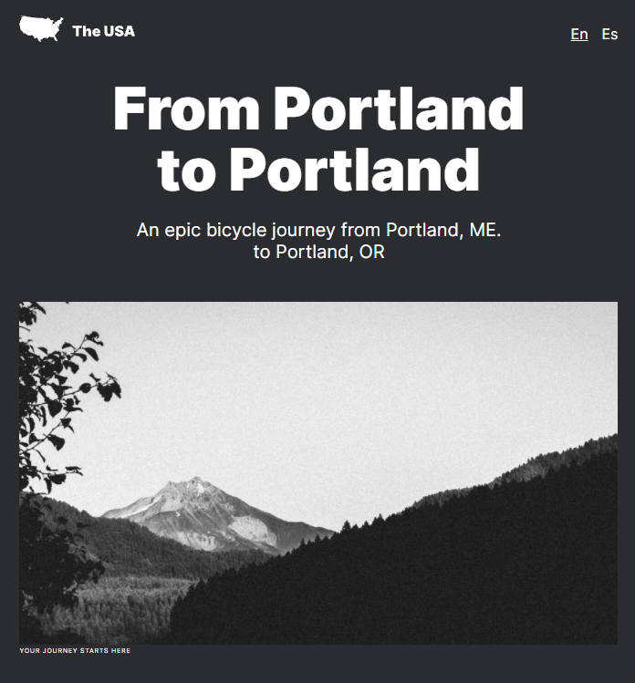

# Project 3: From Portland to Portland

**Intro**

This is a project about traveling across the US. I've made it so all the elements are displayed correctly on popular screen sizes.

**Figma**

* [Link to the project brief on Figma](https://www.figma.com/file/xM9rNsdK4iNcFJmDZho3Aw/Sprint-3%3A-From-Portland-to-Portland-%2F-desktop-%2B-mobile?node-id=500%3A0)

**Techniques**

Grid formatting, Flexbox, and Media Queries were fun to learn, and help this project look its best no matter the device!

**Deployment**

kethianne-portland.surge.sh

**Demo**

https://www.loom.com/share/c396a9b855f44a62aa568f712f41b61c?sharedAppSource=personal_library
